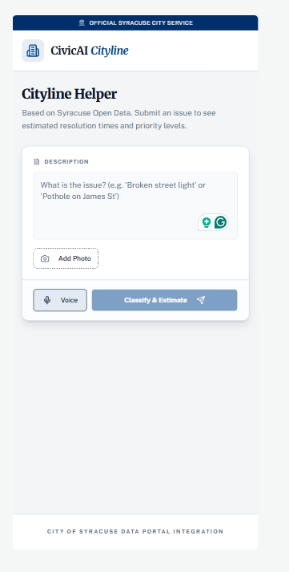
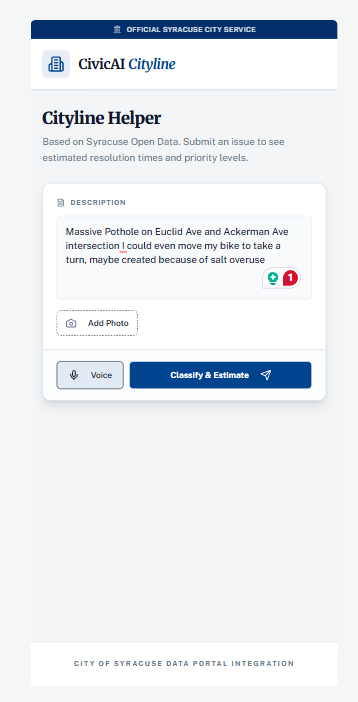
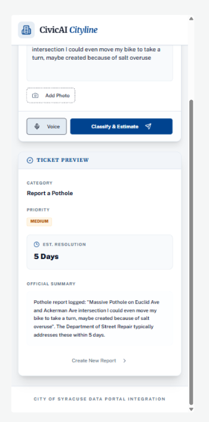

# CivicAI – Cityline Helper

CivicAI is a prototype web application that helps Syracuse residents better understand and structure service requests before submitting them to the official SYRCityline portal. Residents can type a short description of an issue (for example, “Huge pothole on Euclid near Comstock”) and CivicAI will:

- Classify the request into a Cityline-style category (e.g., “Pothole”).
- Estimate how long similar issues have historically taken to be resolved.
- Assign a simple pressingness level (low / medium / high) based on deviation from service-level benchmarks.
- Present a ticket-style preview that can be used to submit a more accurate request via SYRCityline.

The project demonstrates how historical open data and lightweight AI can improve civic user experiences and make service expectations more transparent.

---

## Project Description and Motivation

SYRCityline and SeeClickFix already allow Syracuse residents to report issues such as potholes, broken streetlights, trash, and snow removal problems. However, residents still face several challenges:

- Choosing the correct category from a long list of options.
- Understanding how long a given request typically takes to resolve.
- Knowing whether an issue is relatively urgent or part of a larger backlog in their neighborhood.
- Navigating web forms, especially for users with lower digital literacy or accessibility needs.

CivicAI addresses these pain points by learning from historical Cityline data. It uses past requests and outcomes to suggest a likely category and a realistic time-to-resolution window, and to surface a pressingness indicator. The goal is not to replace SYRCityline, but to act as a “helper” layer that:

- Makes it easier for residents to describe and submit issues.
- Improves the quality and consistency of categories in submitted requests.
- Provides data-informed expectations instead of opaque wait times.

---

## Features

- **Text-based request classification**  
  Type a natural-language description; CivicAI predicts the most likely Cityline category.

- **Time-to-resolution estimation**  
  Uses historical resolution times to estimate how long similar issues usually take.

- **Pressingness score**  
  Computes a simple low/medium/high pressingness label by comparing predicted time to category-specific SLA benchmarks.

- **Ticket preview**  
  Generates a structured summary that mirrors the fields residents see in SYRCityline, making it easier to transfer information into the official system.

- **Optional LLM explanations**  
  When enabled, an external large language model can generate a short, human-friendly explanation of why a category and time estimate make sense, emphasizing that estimates are based on past data and are not guarantees.

---

## Screenshots / Demo


-  – Main input screen
-  – Query for Complaint
-  – Estimate and Submission

Local demo (development):

- https://attached-assets--padwalanjaneya.replit.app

---

## Installation and Usage

### Prerequisites

- Python 3.10+
- Node.js 18+ and npm
- A Cityline / SeeClickFix dataset export (CSV)
- (Optional) API keys if you enable LLM explanations:
  - `OPENAI_API_KEY` and/or
  - `ANTHROPIC_API_KEY` and/or
  - `GEMINI_API_KEY`

### 1. Data and Model Preparation (offline)

1. Export the Cityline dataset to `data/cityline_requests.csv` (or similar).
2. Run the modeling notebook or script (not included here) to:
   - Clean and preprocess the data.
   - Construct a combined text field from `Summary` + `Description`.
   - Compute `resolution_days` from `Minutes_to_Close` / timestamps.
   - Derive per-category SLA benchmarks from `Sla_in_hours`.
   - Train and save:
     - `backend/models/cityline_text_classifier.joblib`
     - `backend/models/cityline_time_regressor.joblib`
     - `backend/models/category_sla_days.json`

These artifacts are what the backend uses for inference; the raw CSV does not need to be deployed with the app.

### 2. Backend API

From the `backend/` directory:

```bash
pip install -r requirements.txt
uvicorn app.main:app --reload

This will start a local API server (by default at http://localhost:8000) exposing:

POST /classify
Request:

json
{ "text": "There is a large pothole on Euclid Avenue near Comstock." }
Response:

json
{
  "category": "Pothole",
  "predicted_resolution_days": 5.2,
  "pressingness": "medium"
}
3. Frontend (Next.js)
From the frontend/ directory:

bash
npm install
npm run dev
Set environment variables (for example via .env.local):

text
BACKEND_BASE_URL=http://localhost:8000
OPENAI_API_KEY=your_openai_key_here   # only if using LLM explanations
Then open http://localhost:3000 in your browser. The main page lets you enter a complaint, call the classification API, and see the results.

### 3.Data Sources

CivicAI is designed to work with Syracuse Cityline / SeeClickFix data obtained from:

Syracuse Open Data Portal (Cityline / SeeClickFix service request datasets).

Associated documentation describing fields such as Category, Minutes_to_Close, Sla_in_hours, and agency names.

When presenting or publishing results, please cite the City of Syracuse and the appropriate open data portal pages. This repository does not redistribute proprietary or sensitive data; it assumes you have independent access to the relevant Cityline dataset.

Known Limitations
Prototype, not production
The application currently acts as a helper and does not submit requests directly to the official SYRCityline portal.

Model quality depends on data
Classification and time estimates are only as good as the historical data used to train the models. Missing values, label noise, or major policy changes can affect performance.

Estimates, not promises
Predicted resolution times are approximate and based on historical averages. Real-world response times depend on weather, emergencies, staffing, and changing priorities.

Limited category coverage
Rare categories may be aggregated or poorly modeled. Pressingness is a heuristic and not an official priority label.

LLM narratives are assistive
If the explanation feature is enabled, the text is generated by an external language model and should be treated as an interpretive aid, not an official city statement.
